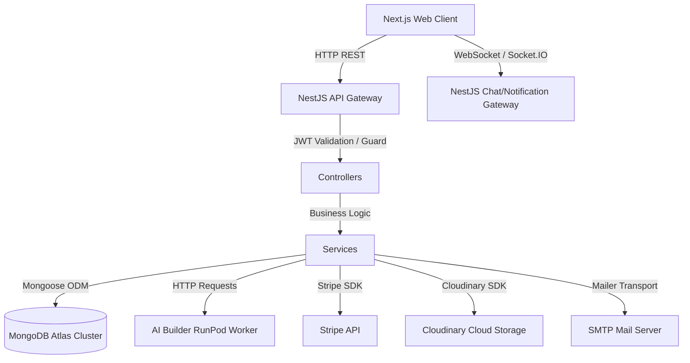
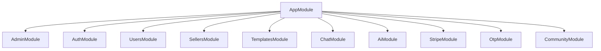
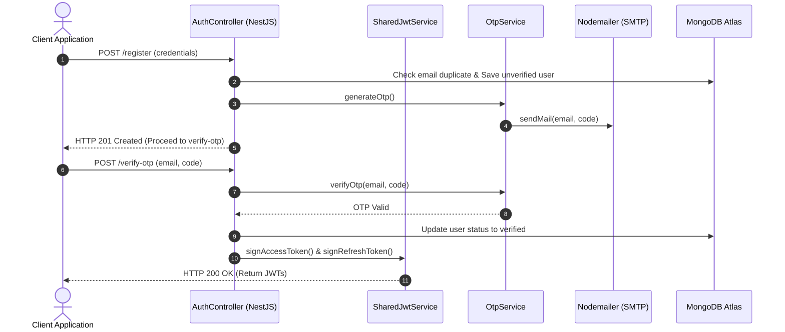
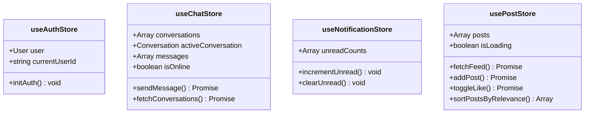

# Thalorix Architecture & Core System Documentation

This document provides a highly detailed, comprehensive technical breakdown of the architecture, folder structures, communication protocols, state management, security mechanisms, and deployment configurations of the Thalorix platform.

---

## 1. Project Overview

Thalorix is a state-of-the-art Web application designed as an **AI-powered Marketplace and Community Platform**. The system provides creators (sellers) with the ability to upload and monetize digital templates (codebases, layouts, and scripts), offers users an automated AI Builder to generate ready-to-run code solutions based on natural language prompts, and integrates a collaborative community feed and messaging system for seamless interaction.

### Core Business Objectives
*   **AI Code Generation**: Allow users to speak naturally and obtain fully working React, Vite, or next.js code environments that compile, preview, and download.
*   **Template Monetization**: Provide a dashboard for sellers to post design files, templates, and packages, handle secure checkouts via Stripe, and download purchases.
*   **Social & Collaborative Environment**: Real-time messaging, post comments, community feeds sorted by a custom relevance score, and notifications.

---

## 2. High-Level System Architecture

Thalorix employs a decoupled Client-Server architecture. The frontend is built on **Next.js 16 (React 19)**, communicating with a **NestJS 11** backend over HTTP (REST) and WebSockets (Socket.IO).



### High-Level Architecture Component Roles
| Component | Technology | Primary Responsibility |
| :--- | :--- | :--- |
| **Web Client** | Next.js 16 (App Router), Tailwind CSS, Zustand | Interactive UI, state management, client-side caching, local storage hooks. |
| **Backend API Gateway** | NestJS 11, Express | Routing, CORS, input verification, rate limiting, global filters. |
| **WebSockets Gateway** | Socket.IO | Real-time chat messaging, notification sync, live connection events. |
| **Database** | MongoDB Atlas, Mongoose | Schema validation, user models, transaction tracking, feed storage. |
| **AI Worker** | RunPod Serverless, Docker | Remote sandbox executing compilation, code building, and packaging. |
| **Stripe** | Stripe Payment Intent / Webhooks | Secure purchases, subscription management, payment validation. |
| **Cloudinary** | Cloudinary SDK | Storing templates, project images, user profile avatars. |
| **Mailer** | NestJS Mailer module, SMTP | Generating and sending OTP codes, transactional notifications. |

---

## 3. Frontend Architecture

The frontend is constructed as a modern Next.js 16 app utilising React 19 features. It leverages Tailwind CSS for layout styling and Framer Motion for micro-interactions and transitions.

### Next.js App Router Structure
The routing system is organized within `src/app/` using route groups, dynamic routing parameters, and layouts:
*   `src/app/(auth)/`: Unauthenticated login, registration, password reset, and verification views.
*   `src/app/dashboard/`: Authenticated user layout enclosing community feeds, messaging boards, profile sheets, and settings.
*   `src/app/admin/`: Dedicated admin login and administrative entry points.

### Frontend Technical Decisions
1.  **Zustand for Global State**: Zero-boilerplate state management stores split logically by feature (e.g. Chat, Posts, Cart, Avatar). This avoids the rendering performance problems associated with React's native Context API in high-frequency scenarios (e.g., chat messaging).
2.  **Axios Instance with Interceptors**:
    *   **Authorization Header Injection**: Interceptor automatically appends the `Authorization: Bearer <token>` header on requests if a token is present in the `localStorage`.
    *   **Token Refresh Cycle**: Interceptor detects `401 Unauthorized` responses, calls the token refresh endpoint, stores the new access token, and retries the failed request.
    *   **Network Failure Resilience**: Interceptors handle server connection timeouts and 5xx errors without forcibly logging out the user, saving auth invalidations for actual 4xx responses.
3.  **Framer Motion Animations**: Leveraged for smooth list updates, slide-out chat windows, and toast alerts.

---

## 4. Backend Architecture

The backend is built using NestJS, a progressive Node.js framework, written in TypeScript. It is designed around the **Controller-Service-Repository (Mongoose Schema)** pattern.

### NestJS Module Decomposition


*   **AppModule**: Imports config configurations, MongoDB connections, global rate-limit guards, and handles bootstrap injection.
*   **AuthModule**: Configures authentication tokens, hashes credentials with `bcrypt`, and registers JWT passports.
*   **UsersModule / SellersModule**: Core user accounts, seller requests, avatars, and balances.
*   **CommunityModule**: Handles feed creation, posts, likes, and comments.
*   **ChatModule**: Exposes Socket.IO gateways to coordinate message states and send alerts.
*   **AiModule**: Integrates endpoints triggering generation requests to remote RunPod worker containers.

---

## 5. Folder Structures

Below is the directory map of both frontend and backend repositories, showcasing the organization of files:

### 5.1 Frontend: `thalorix-web`

```
thalorix-web/
├── public/                 # Static assets (images, logos)
├── src/
│   ├── app/                # Next.js App Router Pages & Layouts
│   │   ├── (auth)/         # Auth pages: login, register, reset-password, verify
│   │   ├── admin/          # Admin portal pages
│   │   ├── dashboard/      # Dashboards: admin, marketplace, community, chats
│   │   ├── layout.tsx      # Global HTML wrappers & fonts
│   │   └── page.tsx        # Public landing index page
│   ├── components/
│   │   ├── features/       # Component sets grouped by business logic modules
│   │   │   ├── admin/      # Admin panels, stats, verify queues
│   │   │   ├── ai-generator/ # Monaco code previews, prompts inputs
│   │   │   ├── auth/       # Login forms, OTP fields, password reset UI
│   │   │   ├── community/  # Post lists, feeds, likes, Emoji pickers
│   │   │   ├── marketplace/# Product lists, cards, Stripe payment modals
│   │   │   ├── messages/   # Active chat bubbles, search lists, attachment tabs
│   │   │   └── profile/    # Avatar updates, security credentials forms
│   │   ├── layout/         # General headers, sidebar navigation wrappers
│   │   └── ui/             # Reusable UI widgets: buttons, inputs, alerts
│   ├── lib/
│   │   ├── api/            # API endpoints, Axios, services
│   │   │   ├── services/   # Services wrapping REST calls (auth, ai, community, otp)
│   │   │   ├── axios.ts    # Custom axios instance with token refresh interceptors
│   │   │   └── endpoints.ts# Global URI endpoints catalog mapping
│   │   ├── hooks/          # Unified React custom hooks (useAI, useAuth, useSocket)
│   │   ├── socket.ts       # Global WebSocket Socket.IO singleton instance
│   │   └── utils.ts        # Helper methods: string masking, formatting
│   ├── store/              # Zustand global state stores
│   │   ├── useAuthStore.ts       # User authentication session sync
│   │   ├── useChatStore.ts       # Active conversations, connection events
│   │   ├── useNotificationStore.ts# Unread message counters, red dot notifications
│   │   └── usePostStore.ts       # Community feed posts and hybrid relevance sort
│   └── types/              # Global TypeScript interfaces
└── package.json            # Scripts and dependency list
```

### 5.2 Backend: `Thalorix-Back-End-dev`

```
Thalorix-Back-End-dev/
├── src/
│   ├── admin/              # Controllers/services managing administrative approvals
│   ├── ai/                 # Interfaces linking to RunPod workers
│   ├── audit/              # Operations logging database changes for monitoring
│   ├── auth/               # Passport authentication, strategies, JWT guards
│   ├── categories/         # Template categorization CRUD
│   ├── chat/               # WebSocket event gateway and messaging services
│   ├── community/          # Post, comment, like models and services
│   ├── friend-request/     # Social sync, friend connections
│   ├── market_place/       # Template reviews, purchases, transactions
│   ├── orders/             # Order creation, details, fulfillment records
│   ├── otp/                # One-Time Password generation, email validation
│   ├── payment/            # Stripe integration, payment validations
│   ├── sellers/            # Seller profiles and earnings logic
│   ├── services/           # External wrappers: Cloudinary, Nodemailer
│   ├── templates/          # Product templates metadata records
│   ├── users/              # Core user models and access schemas
│   ├── app.module.ts       # Root module importing dependency injections
│   └── main.ts             # Bootstrapping gateway, CORS, security parser
├── package.json            # Application dependencies and runtime commands
└── tsconfig.json           # Type mapping configurations
```

---

## 6. Communication & Data Flow

### 6.1 HTTP REST Communication Flow

Most actions, such as browsing templates, uploading assets, updating profile credentials, and requesting verification codes, run via HTTP REST requests.

```
Next.js Client                 Axios Interceptor                NestJS Controller               MongoDB Database
     |                                 |                               |                               |
     |---- HTTP Post login ----------->|                               |                               |
     |     (email & password)          |---- Fwd request ------------->|                               |
     |                                 |                               |---- Verify credentials ------>|
     |                                 |                               |<--- Return matched user ------|
     |                                 |                               |                               |
     |                                 |                               |---- Generate Access JWT ------>|
     |                                 |<--- Return HTTP 200 (JWT) ----|                               |
     |                                 |     & Refresh Token           |                               |
     |                                 |                               |                               |
     |                                 |-- Saves token to localStorage |                               |
     |<--- Resolves call --------------|                               |                               |
```

### 6.2 Real-Time WebSockets Communication Flow

The real-time messaging, notification updates, and status checks rely on WebSocket communication managed by Socket.IO.

```
Client (useSocket hook)           Socket.IO Gateway (ChatGate)            ChatService                MongoDB Database
          |                                   |                                |                            |
          |---- emits 'join' room ----------->|                                |                            |
          |                                   |-- Join client to Socket room   |                            |
          |                                   |                                |                            |
          |---- emits 'newMessage' ---------->|                                |                            |
          |     (chatId, recipientId, text)   |---- calls sendMessage() ------>|                            |
          |                                   |                                |---- Save message document->|
          |                                   |                                |<--- Return saved message --|
          |                                   |<--- Success callback ----------|                            |
          |                                   |                                |                            |
          |                                   |---- Broadcasts 'messageRec' -->|                            |
          |                                   |     to recipient room          |                            |
          |<--- Receive live message ---------|                                |                            |
```

---

## 7. Authentication & Security

Thalorix implements a comprehensive security system based on JWT tokens, Route guards, Role-based Access Control (RBAC), and sanitization checks.

### 7.1 Multi-Stage Authentication Flow



### 7.2 Custom Input Sanitization Guard (`main.ts`)
To protect database integrity and defend against Cross-Site Scripting (XSS) and injection attempts, a global request body parser is configured in `main.ts` with checks on incoming express JSON:
```typescript
app.use(
  express.json({
    verify: (req: any, res, buf) => {
      req.rawBody = buf; // For Stripe Webhooks signature verification
      
      const url: string = req.originalUrl || req.url || '';
      if (url.includes('/stripe/webhook')) return;

      const body = buf.toString();
      
      // Skip check on coding/AI/chat endpoints to allow users to generate and share code
      if (!url.includes('/ai/') && !url.includes('/chat/') && !url.includes('/community/')) {
        if (body.match(/<[^>]*>/g)) {
          throw new BadRequestException('HTML tags are not allowed');
        }
        if (body.match(/\bon\w+\s*=/gi)) {
          throw new BadRequestException('Event handlers are not allowed');
        }
        if (body.match(/javascript:/gi)) {
          throw new BadRequestException('JavaScript protocol is not allowed');
        }
      }
    },
  }),
);
```

### 7.3 Role-Based Access Control (RBAC)
User access control is categorized into three roles: `user`, `seller`, and `admin`. Access is validated in controllers via NestJS guards:
*   **JwtAuthGuard**: Validates the authentication state and extracts user session context.
*   **RolesGuard / AdminGuard**: Intercepts the request and parses the user role metadata to restrict protected administration endpoints (e.g. template review approval).

---

## 8. State Management System

Zustand stores in `src/store/` represent the global frontend memory. They are configured as follows:



### 8.1 Hybrid Feed Sorting Logic (`usePostStore.ts`)
The `usePostStore` implements a **Facebook-style client-side sorting algorithm** inside the `sortPostsByRelevance` helper. The score of a post is calculated dynamically based on engagement (likes, comments) and age (time since creation or recent activities/bumps):

```typescript
const getAgeInHours = (post: PostData): number => {
  // Use updatedAt (representing last activity bump like new comments/likes) if newer
  const referenceTime = post.updatedAt 
    ? new Date(post.updatedAt) 
    : (post.createdAt ? new Date(post.createdAt) : new Date());
  const now = new Date();
  const diffMs = now.getTime() - referenceTime.getTime();
  return Math.max(0, diffMs / (1000 * 60 * 60));
};

export const calculatePostScore = (post: PostData): number => {
  const likes = post.likes || 0;
  const comments = post.comments || 0;
  const shares = post.shares || 0;
  const ageInHours = getAgeInHours(post);
  
  // Weights: Likes * 1, Comments * 3, Shares * 5
  return (likes * 1 + comments * 3 + shares * 5) / Math.pow((ageInHours + 2), 1.5);
};

export const sortPostsByRelevance = (posts: PostData[]): PostData[] => {
  const postsCopy = [...posts];
  return postsCopy.sort((a, b) => {
    const scoreA = calculatePostScore(a);
    const scoreB = calculatePostScore(b);
    
    if (Math.abs(scoreA - scoreB) > 0.0001) {
      return scoreB - scoreA; // Sort descending by score
    }
    // Fallback to chronological (newest first) on equal score
    const dateA = a.createdAt ? new Date(a.createdAt).getTime() : 0;
    const dateB = b.createdAt ? new Date(b.createdAt).getTime() : 0;
    return dateB - dateA;
  });
};
```

---

## 9. Performance & Deployment Optimization

### 9.1 Free-Tier Cold Start Optimizations (Render / Render-alike Services)
Since the backend runs on cloud hosting providers with free-tier CPU throttling and scale-to-zero capabilities, several optimizations are applied:
1.  **Axios Safe Logouts**: On token refresh failures, the interceptor checks the status code. It prevents triggering aggressive storage flushes and logout redirects on transient `502/503/504 Bad Gateway` network timeouts, executing logouts only on true `4xx` auth failures.
2.  **Optimistic UI Updates**: Functions like liking a post or sending a message update the local Zustand memory immediately. The client renders the success state while the backend processing completes asynchronously in the background.

### 9.2 Build & Bundle Optimization
1.  **Webpack Compilation inside Next.js**: The script `"dev": "next dev --webpack"` is configured to speed up hot-reloads during component modifications.
2.  **Modular Dependency Imports**: Dynamically importing heavy frontend modules (such as Monaco Editor or Emoji Picker) ensures they are code-split and only loaded when needed.
