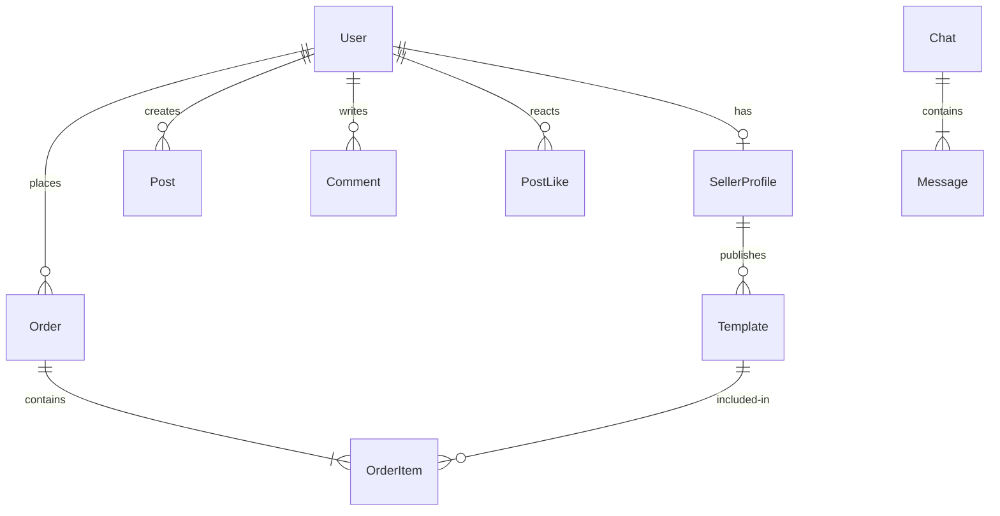

# Thalorix Backend & Integration Documentation

This document provides a highly detailed, service-level breakdown of the database schemas, NestJS backend modules, controllers, validation strategies, and third-party API integrations (Stripe, Cloudinary, Socket.IO, Nodemailer) utilized across the Thalorix platform.

---

## 1. Mongoose Database Schema Design

Thalorix uses MongoDB Atlas as its database cluster, structured through Mongoose ODM schemas.



### 1.1 Core Schemas Definition

#### 1. User Schema (`src/users/schemas/user.schema.ts`)
Tracks account credentials, profile details, and role configuration:
*   `email` (String, required, unique, indexed)
*   `password` (String, required, selected: false)
*   `name` / `username` (String, required)
*   `avatar` / `avatarUrl` (String, default: default avatar path)
*   `role` (String, enum: `['user', 'seller', 'admin']`, default: `user`)
*   `credits` (Number, default: 50)
*   `isVerified` (Boolean, default: false)

#### 2. Template Schema (`src/templates/schemas/template.schema.ts`)
Stores the digital assets published by sellers:
*   `title` (String, required, indexed)
*   `description` (String, required)
*   `price` (Number, required)
*   `fileUrl` (String, required)
*   `image` (String)
*   `sellerId` (ObjectId referencing `User`, indexed)
*   `status` (String, enum: `['pending', 'approved', 'rejected']`, default: `pending`)
*   `isActive` (Boolean, default: true)
*   `fileSize` / `format` / `dimensions` / `license` (String)

#### 3. Post Schema (`src/community/schemas/post.schema.ts`)
Tracks social feed posts:
*   `userId` (ObjectId referencing `User`, indexed)
*   `content` (String, required)
*   `image` (String, optional)
*   `likesCount` (Number, default: 0)
*   `commentsCount` (Number, default: 0)
*   `timestamps` (Automatically injected `createdAt` and `updatedAt`)

---

## 2. Authentication & Verification Services

The authentication layer manages user onboarding validation through OTP, credential hashing, and JWT authorization checks.

### 2.1 OTP Generation and SMTP Verification (`src/otp/otp.service.ts`)
OTPs are calculated dynamically using `otplib` and emailed using `@nestjs-modules/mailer` (Nodemailer transporter):

```typescript
import { Injectable } from '@nestjs/common';
import { MailerService } from '@nestjs-modules/mailer';
import * as otplib from 'otplib';

@Injectable()
export class OtpService {
  constructor(private mailerService: MailerService) {
    // Configure OTP generation parameters
    otplib.authenticator.options = { step: 600, window: 1 }; // 10 minutes validation window
  }

  async generateAndSendOtp(email: string): Promise<string> {
    const secret = otplib.authenticator.generateSecret();
    const token = otplib.authenticator.generate(secret);
    
    // Save secret to database / cache (omitted for brevity)
    await this.saveOtpSecret(email, secret);

    // Send transaction email
    await this.mailerService.sendMail({
      to: email,
      subject: 'Verify Your Thalorix Account',
      template: './otp-verification', // handlebars template
      context: {
        code: token,
      },
    });

    return token;
  }

  async verifyOtp(email: string, token: string): Promise<boolean> {
    const secret = await this.getOtpSecret(email);
    if (!secret) return false;
    
    const isValid = otplib.authenticator.check(token, secret);
    if (isValid) {
      await this.deleteOtpSecret(email);
    }
    return isValid;
  }
}
```

### 2.2 JWT Strategies & Route Guards
Protected endpoints use two Passport guards sequentially:
1.  **JwtAuthGuard**: Validates that the HTTP Authorization header contains a valid access JWT.
2.  **AccessTokenGuard**: Validates that the access token payload matches the user metadata in the DB.
3.  **RolesGuard**: Parses role context metadata values (e.g. `@Roles('admin')`) and blocks requests with invalid user scopes.

---

## 3. Stripe Payments & Webhooks Integration

Stripe checkout handles payments securely. NestJS captures the callback webhook dynamically to update orders and seller wallets.

### 3.1 Checkout Session Construction (`src/payment/stripe.controller.ts`)
```typescript
@Post('create-checkout-session')
@UseGuards(JwtAuthGuard, AccessTokenGuard)
async createCheckoutSession(@Req() req: any, @Body() dto: CreateCheckoutSessionDto) {
  const orderIds = dto.orderIds || [dto.orderId];
  const items = [];
  
  for (const id of orderIds) {
    const order = await this.ordersService.findOne(id, req.user.userId);
    if (order.paymentStatus !== PaymentStatus.UNPAID) {
      throw new BadRequestException(`Order ${id} already paid`);
    }
    
    items.push({
      name: order.template.title,
      amount: Math.round(order.price * 100), // convert to cents
      quantity: 1,
    });
  }

  const session = await this.stripeService.createCheckoutSession(
    items,
    req.user.email,
    orderIds.join(','), // CSV mapped in metadata for webhooks
    dto.successUrl,
    dto.cancelUrl
  );

  return { sessionId: session.id, url: session.url };
}
```

### 3.2 Secure Webhook Signature Validation
Stripe requests require raw body buffers for signature verification.
```typescript
@Post('webhook')
@HttpCode(200)
async handleWebhook(
  @Req() req: RawBodyRequest<Request>,
  @Headers('stripe-signature') signature: string,
) {
  if (!req.rawBody) {
    throw new BadRequestException('Raw request body missing');
  }

  try {
    const event = await this.stripeService.constructEventFromPayload(
      signature,
      req.rawBody,
    );

    if (event.type === 'checkout.session.completed') {
      const session = event.data.object;
      const orderIdsStr = session.metadata?.orderId;
      if (orderIdsStr) {
        const orderIds = orderIdsStr.split(',');
        for (const orderId of orderIds) {
          await this.ordersService.markAsPaid(orderId);
          // Credit seller balance logic
          await this.sellersService.creditSellerShare(orderId);
        }
      }
    }
    return { received: true };
  } catch (err) {
    throw new BadRequestException(`Webhook validation failed: ${err.message}`);
  }
}
```

---

## 4. Socket.IO Communication Gateway

The backend coordinates real-time chat updates and notifications through Socket.IO gateways (`src/chat/chat.gateway.ts`).

### 4.1 Room Joining & Event Broadcasting
```typescript
import { WebSocketGateway, WebSocketServer, SubscribeMessage, MessageBody, ConnectedSocket } from '@nestjs/websockets';
import { Server, Socket } from 'socket.io';

@WebSocketGateway({ cors: { origin: '*' } })
export class ChatGateway {
  @WebSocketServer() server: Server;

  @SubscribeMessage('join')
  handleJoinRoom(
    @MessageBody() data: { chatId: string },
    @ConnectedSocket() client: Socket,
  ) {
    client.join(data.chatId);
    console.log(`📡 Socket client ${client.id} joined room: ${data.chatId}`);
  }

  @SubscribeMessage('sendMessage')
  async handleNewMessage(
    @MessageBody() data: { chatId: string; recipientId: string; text: string; senderId: string },
  ) {
    const savedMsg = await this.chatService.saveMessage(data);
    
    // Broadcast message to room members
    this.server.to(data.chatId).emit('messageRec', savedMsg);
    
    // Notify recipient dynamic notification room if they are not active in chat
    this.server.to(`user_${data.recipientId}`).emit('notification', {
      type: 'new_message',
      chatId: data.chatId,
      senderName: savedMsg.senderName,
    });
  }
}
```

---

## 5. Cloudinary Multer Uploader Service

Asset templates and avatars are uploaded via Multi-part forms parsed into memory streams and sent to Cloudinary storage.

### 5.1 Service Stream Handler (`src/services/cloudinary/cloudinary.service.ts`)
```typescript
import { Injectable } from '@nestjs/common';
import { v2 as cloudinary } from 'cloudinary';
import * as streamifier from 'streamifier';

@Injectable()
export class CloudinaryService {
  async uploadFile(file: Express.Multer.File, folder: string): Promise<any> {
    return new Promise((resolve, reject) => {
      const uploadStream = cloudinary.uploader.upload_stream(
        { folder: `thalorix/${folder}` },
        (error, result) => {
          if (error) return reject(error);
          resolve(result);
        }
      );
      
      // Convert memory buffer to readable stream
      streamifier.createReadStream(file.buffer).pipe(uploadStream);
    });
  }
}
```

---

## 6. Audit Logging System

For logging administrative actions, financial transactions, and verification queue status changes, the `AuditLog` module records actions into database tracking collections:
*   `userId` (ObjectId referencing `User`, indexed)
*   `action` (String, required, indexed)
*   `description` (String)
*   `ipAddress` (String)
*   `userAgent` (String)
*   `metadata` (Mongoose Schema Types Mixed)

---

## 7. Technical Interview Questions

### 7.1 Database & Schemas
1.  **Q**: Explain why you chose MongoDB and Mongoose for Thalorix. How do you implement references (like `sellerId` in the template schema) and populate them efficiently without causing N+1 query problems?
2.  **Q**: Why did you use `{ timestamps: true }` in the community post schema? How does Mongoose utilize this for the "Bump" sorting algorithm on the client side?
3.  **Q**: What is the impact of placing index fields on `email` and `sellerId` in Mongoose? How does indexing affect write performance?
4.  **Q**: Describe how you handle cascading deletes in Mongoose (e.g., deleting a post and deleting all comments linked to its `postId`).
5.  **Q**: How would you modify the schema structure if the business requirements scaled to support localized multi-currency pricing dynamically?

### 7.2 Auth & Validation
1.  **Q**: Describe the implementation of OTP verification with `otplib` and Nodemailer. How do you prevent OTP replay attacks?
2.  **Q**: Explain the difference between `JwtAuthGuard` and `AccessTokenGuard`. Why are both guards used on protected endpoints?
3.  **Q**: How do you handle JWT secret updates in production without causing sudden session expirations for active users?
4.  **Q**: How does NestJS `ValidationPipe` transform raw client body payloads into validated DTO objects?
5.  **Q**: How did you handle input security checks for AI and chat routes compared to normal routes in `main.ts`?

### 7.3 Stripe Payments
1.  **Q**: How does the backend securely verify Stripe webhook events? Why is `req.rawBody` required, and how did you configure NestJS to preserve it?
2.  **Q**: How do you prevent double-spending or duplicate orders when receiving asynchronous webhooks from Stripe?
3.  **Q**: How are orders marked as paid or failed dynamically through Stripe event types?
4.  **Q**: Describe how you pass metadata (like `orderId`) through a checkout session to the webhook receiver.
5.  **Q**: Explain how you split transaction fees between the platform and the seller wallet on invoice payment success.

### 7.4 Socket.IO Gateway
1.  **Q**: How does NestJS WebSocket Gateway scale horizontally across multiple instances when using Socket.IO?
2.  **Q**: Describe the flow for routing notifications dynamically to offline or inactive users when a new message is saved.
3.  **Q**: How do you authorize socket connections at handshake before joining rooms?
4.  **Q**: Explain the performance difference between WebSockets and HTTP polling in real-time chat scenarios.
5.  **Q**: How do you implement connection heartbeats and reconnection handling in NestJS gateways?

### 7.5 Asset Storage & Uploads
1.  **Q**: Why did you choose memory buffers over temporary local file storage in Multer before transferring files to Cloudinary?
2.  **Q**: How do you handle large file uploads without blocking the Event Loop in Node.js?
3.  **Q**: Describe how you implement validation for uploaded template sizes and formats (e.g., accepting only `.zip` or images under 5MB).
4.  **Q**: What measures do you take to secure URLs returned by Cloudinary from illegal hotlinking?
5.  **Q**: How would you configure chunked uploads for template sizes exceeding 100MB?
